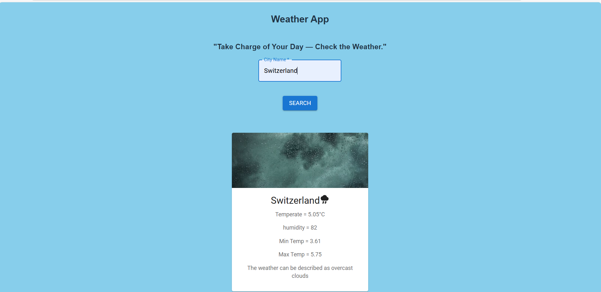

# ⛅ WeatherPedia

## 📸 Screenshot

WeatherPedia is a beautiful and fast weather application built with **React + Vite**, using the **OpenWeather API**. It provides real-time weather details with dynamic icons and images based on the current climate.

---

## 🚀 Features
✅ Search weather by city name  
✅ Live temperature, humidity, min/max  
✅ Dynamic weather icons (Hot / Cold / Rainy)  
✅ Background image changes with weather  
✅ Error handling for invalid cities  
✅ Built with Material UI (MUI)  
✅ Responsive and clean UI  

---

🧠 How It Works

1. User enters a city name

2. WeatherPedia calls OpenWeather API

3. The app displays:

City

Temperature

Min/Max temperature

Humidity

Weather description

4. Icon + image changes based on weather conditions
---

## 🛠️ Tech Stack
- React  
- Vite  
- Material UI (MUI)  
- CSS  
- OpenWeather API  

---

🙌 Contributing

Pull requests are welcome.
For major changes, please open an issue first.

